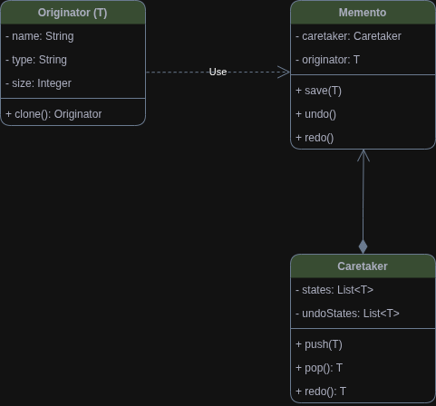

> # Design Pattern POC

> ### *Creational*

* Creational Patterns are all about different ways to create objects.

> ### *Structural*

* Structural Patterns are about relationships between these objects.

> ### *Behavioural*

* Behavior Patterns are about the interaction and communication of these objects.

1. ### *Memento Pattern*
    1. Memento Pattern for implementing an undo and redo mechanism.  
       
2. ### *State Pattern*
    1. State Pattern lets an object alter its behavior when its internal state changes